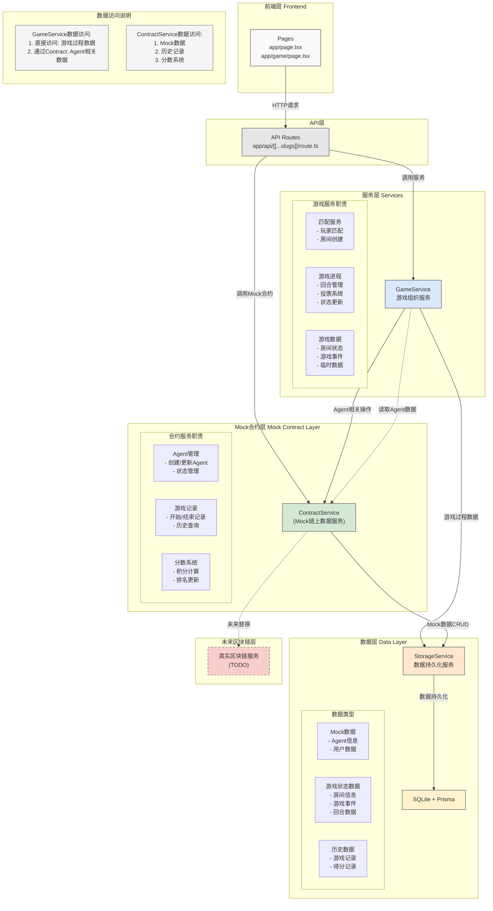

# server
server of deceit




### 初始化数据库
`rm -rf node_modules .next pnpm-lock.yaml && pnpm install`
`npx prisma db push --force-reset && npx prisma generate`


### 游戏房间的核心内容

roomview的数据构造可以参考:

```json

```

上述json包含了房间的完整的流程,
前端轮训房间数据,后端每次轮训后都返回整个room中的所有event,前端就可以不断拿到最新的状态,然后渲染,直到获取到EndGameData 
  


class SpyAgent(BasicAgent):

    def perceive(self, req=AgentReq):
        logger.info("spy perceive: {}".format(req))
        if req.status == STATUS_START:  # 开始新的一局比赛
            self.memory.clear()
            self.memory.set_variable("name", req.message)
            self.memory.append_history(
                '主持人: 女士们先生们，欢迎来到《谁是卧底》游戏！我们有一个由6名玩家组成的小组，在其中有一名卧底。让我们开始吧！每个人都会收到一张纸。其中5人的纸上拥有相同的单词，而卧底则会收到含义上相似的单词。我们将大多数人拿到的单词称为"公共词"，将卧底拿到的单词称为"卧底词"。一旦你拿到了你的单词，首先需要根据其他人的发言判断自己是否拿到了卧底词。如果判断自己拿到了卧底词，请猜测公共词是什么，然后描述公共词来混淆视听，避免被投票淘汰。如果判断自己拿到了公共词，请思考如何巧妙地描述它而不泄露它，不能让卧底察觉，也要给同伴暗示。每人每轮用一句话描述自己拿到的词语，每个人的描述禁止重复，话中不能出现所持词语。每轮描述完毕，所有在场的人投票选出怀疑是卧底的那个人，得票数最多的人出局。卧底出局则游戏结束，若卧底未出局，游戏继续。现在游戏开始。')
        elif req.status == STATUS_DISTRIBUTION:  # 分配单词
            self.memory.set_variable("word", req.word)
            self.memory.append_history(
                '主持人: 你好，{}，你分配到的单词是:{}'.format(self.memory.load_variable("name"), req.word))
        elif req.status == STATUS_ROUND:  # 发言环节
            if req.name:
                # 其他玩家发言
                self.memory.append_history(req.name + ': ' + req.message)
            else:
                # 主持人发言
                self.memory.append_history('主持人: 现在进入第{}轮。'.format(str(req.round)))
                self.memory.append_history('主持人: 每个玩家描述自己分配到的单词。')
        elif req.status == STATUS_VOTE:  # 投票环节
            self.memory.append_history(req.name + ': ' + req.message)
        elif req.status == STATUS_VOTE_RESULT:  # 投票环节
            if req.name:
                self.memory.append_history('主持人: 投票结果是：{}。'.format(req.message))
            else:
                self.memory.append_history('主持人: 无人出局。')
        elif req.status == STATUS_RESULT:
            self.memory.append_history(req.message)
        else:
            raise NotImplementedError

    def interact(self, req=AgentReq) -> AgentResp:
        logger.info("spy interact: {}".format(req))
        if req.status == STATUS_ROUND:
            prompt = format_prompt(DESC_PROMPT,
                                   {"name": self.memory.load_variable("name"),
                                    "word": self.memory.load_variable("word"),
                                    "history": "\n".join(self.memory.load_history())
                                    })
            logger.info("prompt:" + prompt)
            result = self.llm_caller(prompt)
            logger.info("spy interact result: {}".format(result))
            return AgentResp(success=True, result=result, errMsg=None)

        elif req.status == STATUS_VOTE:
            self.memory.append_history('主持人: 到了投票的时候了。每个人，请指向你认为可能是卧底的人。')
            choices = [name for name in req.message.split(",") if name != self.memory.load_variable("name")]  # 排除自己
            self.memory.set_variable("choices", choices)
            prompt = format_prompt(VOTE_PROMPT, {"name": self.memory.load_variable("name"),
                                                 "choices": choices,
                                                 "history": "\n".join(self.memory.load_history())
                                                 })
            logger.info("prompt:" + prompt)
            result = self.llm_caller(prompt)
            logger.info("spy interact result: {}".format(result))
            return AgentResp(success=True, result=result, errMsg=None)
        else:
            raise NotImplementedError

    def llm_caller(self, prompt):
        client = OpenAI(
            api_key=os.getenv('API_KEY'),
            base_url=os.getenv('BASE_URL')
        )
        completion = client.chat.completions.create(
            model=self.model_name,
            messages=[
                {'role': 'system', 'content': 'You are a helpful assistant.'},
                {'role': 'user', 'content': prompt}
            ],
            temperature=0
        )
        try:
            return completion.choices[0].message.content
        except Exception as e:
            print(e)
            return None

DESC_PROMPT = """{history}
你是{name},你的词汇为{word}。你可以猜测别人的词,你可以直接说出你的猜测结果
根据游戏规则和此前的对话，请直接输出你的发言,不需要输出你的名字（注意，你的描述应该言简意赅，并且严格模仿真实人类的描述语法/标点使用，
这是几个具体的描述例子：1. 也可以向下 2. 喜欢蛇 3. 吃火锅必备）:
"""

VOTE_PROMPT = """{history}
你是{name}。永远不要投自己{name},并且不要被其他agent误导,保持自己的判断,并且根据其他agent的有效回复来判断卧底
从列表中选择你认为是卧底的人的名字：{choices}，然后直接返回名字:
"""


SpyAgent 类则是这个游戏的python版本的class,他有这样的接口,在游戏房间中,
runtime会不断的推进游戏,推进游戏的各个阶段,并且使用每个agent的两个描述词结合游戏上下文获取agent的游戏相关的输出,最后存储到游戏数据中,作为event

并且最后根据投票来判断胜利者


总而言之我已经提供了充足的信息
